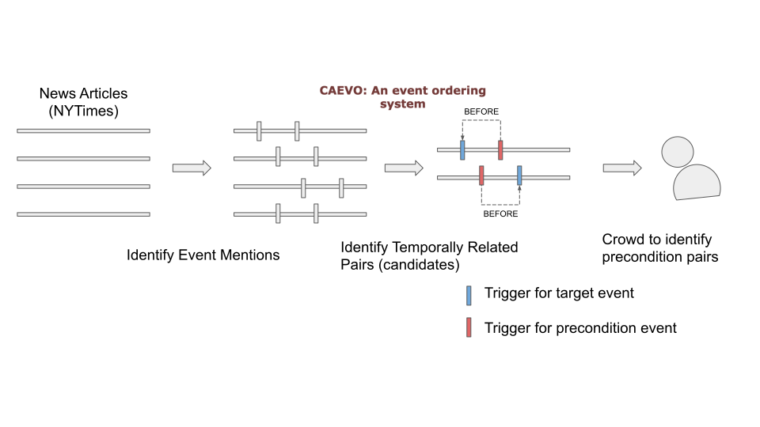
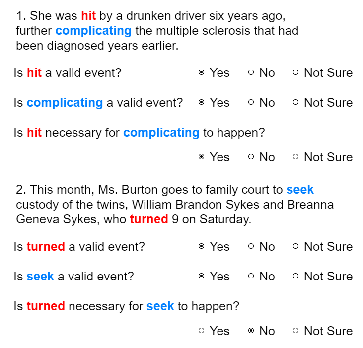
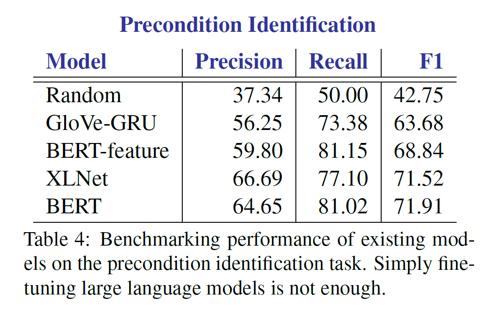
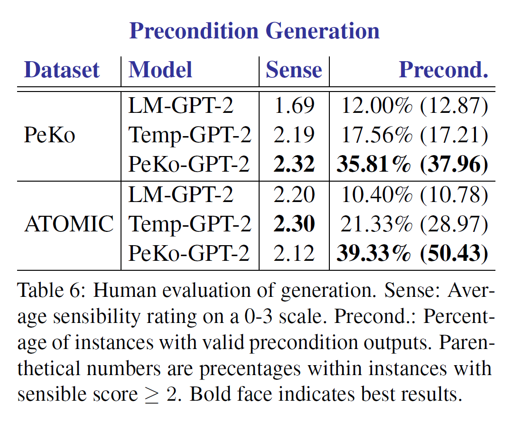

# PeKo: A Large Scale Precondition Knowledge Dataset

## Overview
PeKo (**P**r**e**condition **K**n**o**wledge) is a large scale crowdsourced event precondition knowledge dataset introduced in our paper "_Modeling Preconditions in Text with a Crowd-sourced Dataset_" at EMNLP Findings 2020 

Preprint coming soon.

## Crowdsourcing Precondition Knowledge

### Data Preparation
We extract events and their temporal relations from news articles using CAEVO ([Chambers et al., 2014](https://www.usna.edu/Users/cs/nchamber/caevo/)), a temporal relation extraction system. We used CAEVO on a random sample of 6,837 articles inthe New York Times Annotated Corpus ([Sandhaus, 2008](https://catalog.ldc.upenn.edu/LDC2008T19)). 
On average CAEVO extracted around 63 events per article, which yielded a total of 3,906 possible relation candidates per document. We filtered these to retain only pairs of events that have a BEFORE or AFTER temporal relation between them. We call the temporally preceding event the _candidate precondition_, and the temporally subsequent event in the pair the _target event_.
### Crowdsourcing Task
The annotators were presented with a text snippet and two event mentions highlighted as shown below. To prune out event extraction errors from CAEVO, the annotators were first asked if the highlighted text denoted valid events. If both triggers were deemed valid, then the annotators evaluated whether or not the candidate precondition event was an actual precondition for the target event. Specifically they check if the candidate event is necessary for the target event to happen.
<p align="center">
  
</p>

As the result of crowdsouring, we have **10,806** preconditions out of **28,948** instances in total.

## Tasks
We now propose two tasks that test for the ability to recognize and generate preconditions in textual contexts. Here we describe evaluations to benchmark the performance of current models on these tasks and to better understand the challenges involved.

### PeKo Task 1: Precondition Identification
Given a text snippet with a target and candidate event pair, the task is to classify if the candidate event is a precondition for the target in the context described by the text snippet. This is a standard sentence-level classification task.
<p align="center">
  
</p>

### PeKo Task 2: Precondition Generation Task
Here we introduce Precondition Generation as a more general challenge that a dataset like PeKo now enables. Given a target event **_t_**, generate an event **_p_** that is a precondition for **_t_**. We benchmark performance on evaluation instances drawn from both PeKo and an out-of-domain dataset [ATOMIC](https://homes.cs.washington.edu/~msap/atomic/).
<p align="center">
  
</p>


## Download
The dataset can be downloaded from [here](https://github.com/StonyBrookNLP/PeKo)

## Citation
Bibtex will be updated soon
   ```
   ```

## Dataset Information

```
data
 ├── peko_all.jsonl             # PeKo dataset
 ├── peko_gen_train.txt         # PeKo generation instances
 ├── peko_gen_dev.txt
 ├── peko_gen_test.txt
 ├── temp_gen_train.txt         # Generation instances for temporal model
 ├── temp_gen_dev.txt
 ├── LM_gen_train.txt           # Generation instances for plain language model
 ├── LM_gen_dev.txt
 └── atomic_samples.txt         # ATOMIC samples for generation task
```
- peko_all.jsonl: PeKo dataset, each line contains a single json document.
  - sent_id: sentence ID
  - source: a candidate precondition event
  - target: a target event
  - label: 1 for precondition, 0 for non-precondition
  - n_yes: the number of votes for precondition
  - n_vote: the number of annotator
  - sent: sentence(s), tokens are separated by space
  
 - {_peko/temp/LM_}\_gen\_\*.txt
 
   Tab separated text files. The first column contains full text, which is used for the generation target and the second column contains a precondition-masked-out instance.
 
 - atomic_samples.txt
 
   The file contains generation seeds from ATOMIC dataset

## Contributors
- [Heeyoung Kwon](https://heeyoungkwon.com) (Stony Brook University)
- Mahnaz Koupaee (Stony Brook University)
- Pratyush Singh (Stony Brook University)
- Gargi Sawhney (Stony Brook University) 
- Anmol Shukla (Stony Brook University) 
- Keerthi Kumar Kallur (Stony Brook University) 
- [Nate Chambers](https://www.usna.edu/Users/cs/nchamber/) (US Naval Academy)
- [Niranjan Balasubramanian](https://www3.cs.stonybrook.edu/~niranjan)
